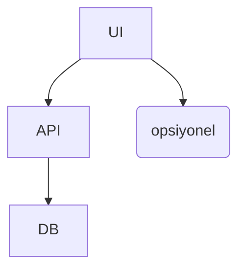

# Mimari Genel Bakış

## Katmanlar

- UI: Next.js (App Router) – Server/Client Components
- API: `app/api/*/route.ts`
- Data: MongoDB (Mongoose modelleri)
- Yardımcılar: `app/lib/*` (db, srs, wer, ai)

## Temel Akış (SRS)

1. Kullanıcı giriş → “Bugün” sayfası → due kelimeler `/api/srs/due`
2. Cevap → SM-2/FSRS hesap → `PoolWord.nextAt` güncelle

## Konuşma/Okuma Doğrulama

- Tarayıcı ASR → transkript → WER hesap → geri bildirim

## Diyagram

